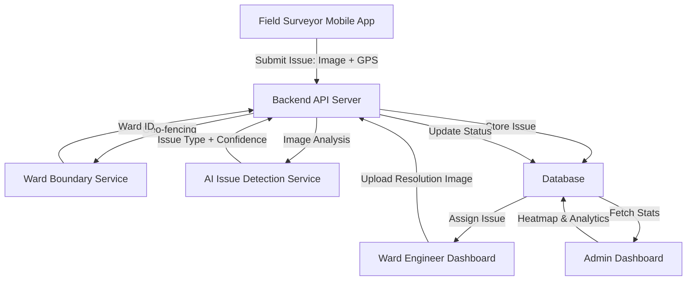

# System Architecture

## Overview

The AI-Based Civic Issue Monitoring System is designed to automate the detection, assignment, and resolution of civic issues in Vadodara's 19 wards. The system targets VMC employees only, with no citizen login required.

Key components:
- **Mobile App**: Used by Field Surveyors to capture issues on-site.
- **Backend**: Handles API requests, geo-fencing, auto-routing, and workflow automation.
- **AI Service**: Processes images to detect and classify civic issues.
- **Database**: Stores user data, ward boundaries, issues, and resolution details.
- **Dashboards**: Web interfaces for Ward Engineers and Admins to monitor and resolve issues.

## Roles
- **Field Surveyor**: Captures issues via mobile app.
- **Ward Engineer**: Reviews assigned issues, uploads resolution images.
- **Admin**: Monitors system-wide statistics and heatmaps.

## Data Flow
1. Field Surveyor captures image and GPS via Mobile App.
2. Mobile App sends data to Backend.
3. Backend performs geo-fencing to assign ward.
4. Backend sends image to AI for issue detection.
5. Issue is stored in Database with auto-assigned department and priority.
6. Ward Engineer receives notification and accesses Dashboard.
7. Engineer uploads resolution image, updating issue status.
8. Admin views analytics on Dashboard.

## Architecture Diagram

